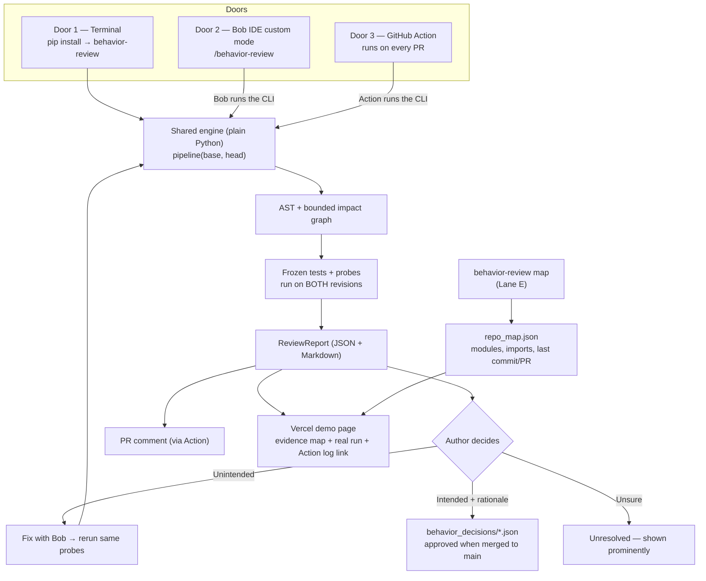
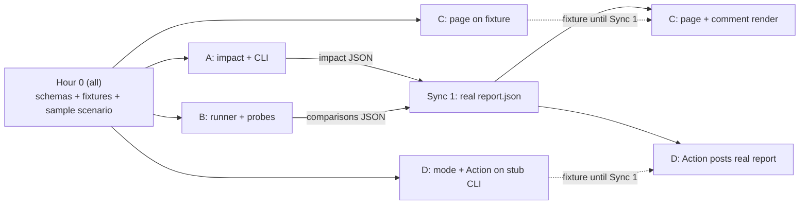

# FINAL PLAN — Behavior Review Before and After a PR

IBM Bob 2.0 Hackathon (lablab.ai) · Updated 26 Sept 2026
Deadline: **27 Sept 2026, 22:00 WIB/Bangkok (15:00 UTC)** · Target upload: **21:00 WIB** · Feature freeze: **14:00 WIB**

This file supersedes HACKATHON_PLAN.md and BOB_BUILD_PLAN.md as the single team plan. Those two files remain useful reference for engineering detail, but where they disagree, this file wins.

**v2 changes (26 Sept, evening):** added **Lane E — Maps** (evidence map per PR + whole-repo module map, §16), documented the **current multi-language adapters** (§17) and the actual web stack (§9), added a Bob-first roadmap line (§18), and an **end-to-end consistency matrix for multi-language repos** (§19) — including a small agreed schema addition, `ReviewReport.analysis`. Everything that touches another lane's files is written as a marked **`TODO(<lane>)`** item so owners can pick it up. Section numbers 1–15 are unchanged.

> **AI proposes. Algorithms verify. Humans decide.**

---

## 1. The idea in one minute

**Problem.** AI coding assistants make it easy to change code you don't fully understand. A small change to a helper function can silently break a caller in *another file* — one that is not in the diff, and not covered by existing tests. The reviewer sees a clean diff and green tests, and approves.

**What we build.** A tool that, *before* a PR is opened (and again after), answers three questions with **real execution evidence**, not AI opinion:

1. **What else could this change affect?** → an impact graph finds callers outside the diff.
2. **Did behavior actually change?** → the same frozen inputs run on the old and new code; outputs are compared.
3. **Was that change intended?** → the author must mark each difference as *unintended* (fix it), *intended* (write the reason), or *unresolved*. Intended changes are saved as versioned decisions the team can look up later.

**Pitch line:** *"Green tests and a clean diff can still hide a broken caller. We show the author what changed in behavior — with proof — before the reviewer ever sees the PR."*

### Framing: Management of Change (MOC) for code

Borrowed from oil & gas, where no change to a running plant is allowed without a formal MOC process. Our flow maps 1:1:

| MOC in industry | Our product |
|---|---|
| Identify what the change touches | Impact graph (AST, callers outside the diff) |
| Hazard assessment | Behavior diff: same inputs, old vs new outputs |
| Sign-off by responsible person | Author disposition: unintended / intended + rationale / unresolved |
| Update controlled documents | `behavior_decisions/` ledger, approved by merge to `main` |
| Incident investigation uses the records | Later reviews cite approved decisions |

Use this analogy in the video intro and slides — it's memorable and shows domain thinking.

---

## 2. Gap analysis (for the Problem & Solution statement)

| | |
|---|---|
| **Current situation** | Authors ship AI-assisted changes; reviewers read the diff and trust CI. Review is slow and trust is low because the reviewer has to reconstruct the impact themselves. |
| **Desired situation** | The author already knows what their change affects and which behaviors changed, and has fixed or justified each difference before asking for review. |
| **The gap** | Diffs only show changed lines. Tests only check what someone thought to test. AI reviewers give *opinions* that can hallucinate. Nothing ties "this caller behaves differently" to "and the author confirmed it was intended." |
| **Existing solutions** | AI PR reviewers (LLM comments on the diff), test impact analysis (selects tests, doesn't find untested behavior changes), code-graph tools like PRISM (show structure, AI runtime is an external LLM, Bob only used during development). |
| **Our solution** | Deterministic impact graph + paired execution on both revisions + mandatory human intent + versioned decision ledger — and **Bob inside the product loop** to write targeted probes and fix unintended changes. |

---

## 3. Why this can win

| What judges should notice | How we deliver it |
|---|---|
| Bob is a **core component**, not just the tool we coded with | A committed **Bob IDE custom mode** (`/behavior-review`) is part of the product: it runs our CLI, reads the evidence, writes probes for uncovered callers, and helps fix unintended changes. Plus every teammate's real Bob task summaries. |
| A real "wow" moment | Existing tests are **all green**, yet our tool shows a caller in another file now returns a different value for the same input. |
| No hallucination | Every claim in the report comes from AST parsing or real execution. The LLM never decides "bug or not." |
| Honest about limits | Unknown edges are shown as *unknown*, never as *safe*. Setup failures are *inconclusive*, never *bug*. |
| Something judges can open | Public Vercel demo page showing a real run, linked to its public GitHub Actions log. |
| One picture explains the product | An **evidence map**: the changed function, the caller outside the diff, and each node colored by what *execution* proved (changed / behavior differs / same / unknown / needs probe). Code-map tools color by "file changed"; we color by "behavior changed" (§16). |

Learned from Bob 1.0 winners (Atlas, Pedigree, Sandbox): none built a custom "agent" — the core was ordinary deterministic code, with AI called in a few focused places. Pedigree used a Bob custom mode + MCP. We follow the same pattern.

---

## 4. Architecture: one engine, three doors, one demo page



**Key design rule:** the engine is `pipeline(base_revision, head_revision)` and knows nothing about GitHub, Bob, or the web. Each door just calls it differently.

| Door | Who | When | How it's called |
|---|---|---|---|
| 1. CLI | Developer | Before PR | `behavior-review --base main --head HEAD` in a terminal |
| 2. Bob custom mode | Developer | Before PR (the showcase path) | Type `/behavior-review` in Bob IDE chat; Bob runs the CLI, explains results, writes missing probes, helps fix |
| 3. GitHub Action | Reviewer | After PR opens / new push | Automatic; posts or updates one PR comment |
| Demo page | Judges | Anytime | Opens a Vercel URL, no install, no login |

**No webhook server, no queue, no worker, no database server.** GitHub Actions replaces all of that. (If Vercel becomes a bottleneck later, move to a small always-on Python host — see §11.)

---

## 5. How each step works (and what it can't claim)

| Step | Method | Claims | Never claims |
|---|---|---|---|
| Changed symbols | Python `ast` on both revisions (other languages: Tree-sitter adapters, see §17) | Which functions/signatures/imports/bodies changed; tags like `signature_changed`, `body_changed` | *Why* it changed |
| Impact graph | Dict/adjacency list; reverse callers up to 2 hops; union of old+new edges | Callers outside the diff, with file:line path, e.g. `price_total → apply_discount` | "No impact" when edges are unresolved — those are listed as **unknown** |
| Existing tests | Freeze the **base** test suite, run the identical suite on both revisions | Pass/fail on each side | That passing = correct |
| Probes | Small deterministic scripts, JSON inputs/outputs, identical bytes on both revisions | "Same input → different output" | Equivalence for all inputs |
| Explanation / probe writing / fix | **Bob** (IDE custom mode) | Proposes probes and fixes, explains results | Any verdict — results only come from execution |
| Decision | Human | Unintended / intended + rationale / unresolved | Bob never picks intent or writes a rationale the author didn't confirm |

### Anti-hallucination rules (non-negotiable)

1. A model's answer is not a test result. Only real process output counts.
2. Unknown edge ≠ no impact. Show it as unknown.
3. Setup/import error, timeout, nondeterminism → **inconclusive**, never "bug".
4. Never edit a probe to make a difference disappear. Fixes rerun the **unchanged** probe.
5. Author intent never overrides failed execution.
6. Every result is labeled: which commit, which probe hash, when it ran.

### Outcomes

| Observation | Label |
|---|---|
| Same outputs, tests pass | `same_on_tested_cases` (not "proven safe") |
| Different value/exception for same input | `delta_observed` → needs a human decision |
| Old test passes on base, fails on new | possible regression **or** intentional contract change → check intent |
| Both revisions fail | pre-existing issue, not blamed on this change |
| Import error / timeout / bad probe | `inconclusive` |

---

## 6. Locked demo scenario (decide in hour 0, don't change after)

A small, original, pure-Python sample package (no DB, network, clock). Example:

```
sample_project/
  pricing/discount.py   # apply_discount()          ← the PR changes this
  pricing/invoice.py    # price_total() calls apply_discount()  ← NOT in the diff
  tests/test_discount.py  # tests apply_discount only — stays GREEN after the change
```

**The PR:** someone (with AI help) "cleans up" `apply_discount` and changes rounding (e.g. round per item instead of on the total).

**What the tool shows:**
1. Diff touches only `discount.py`. **All existing tests pass.**
2. Impact graph: `invoice.price_total` (other file) calls the changed function.
3. Bob writes a probe for `price_total` with a boundary input.
4. Probe runs on both revisions: old `100.00`, new `99.99` → `delta_observed`.
5. Author marks it **unintended** → Bob helps fix → same probe reruns → `same_on_tested_cases`, linked to the original delta.

Required scenarios (each needs real run evidence):

| # | Scenario | Expected |
|---|---|---|
| 1 | Helper change breaks caller outside diff, **existing tests green** | Impact path, delta, unintended, Bob fix, rerun |
| 2 | Intentional policy change (e.g. max discount 50% → 30%) | Delta, required rationale, decision JSON, approved by merge |
| 3 | Behavior-preserving refactor | Structural change, no delta on frozen cases |
| 4 | Broken setup / unresolved import | Inconclusive, never "safe", never "bug" |
| 5 | Later change to the same function | Report cites the approved decision from #2 |

---

## 7. Decision ledger (`behavior_decisions/`)

One JSON per decision: `id`, repo, path/symbol, base/head SHAs, probe hash, before/after behavior, intent, rationale, requirement ref (optional), status, `supersedes`.

**Trust rule (simple):** a decision written in a PR branch is only *proposed*. It becomes **approved when it is merged into `main`** — the normal PR review is the approval. No separate login or reviewer system.

Lookup matches exact repo + path + symbol from approved records on `main`. Stale/renamed/superseded records are shown as such, never guessed. History informs a review; it never auto-approves a new difference.

---

## 8. Scope

| Priority | Feature | Done when |
|---|---|---|
| **P0.1** | Revision pair + schema | CLI takes two local commits, no PR needed, doesn't touch the working tree |
| **P0.2** | AST + bounded impact | Scenario 1 shows the caller outside the diff with file:line path and unknowns listed |
| **P0.3** | Paired execution | Identical tests + probes run on both revisions; real outputs saved |
| **P0.4** | Human decision loop | Every delta gets unintended / intended+rationale / unresolved; fixes rerun |
| **P0.5** | Report | JSON + Markdown: impact path, inputs, old/new outputs, decision, limits |
| **P0.6** | **Bob custom mode** | `/behavior-review` in Bob IDE runs the CLI, explains, proposes a probe, helps fix |
| **P1.1** | GitHub Action | PR → Action runs CLI → one PR comment updated per push; report uploaded as artifact |
| **P1.2** | Ledger + lookup | Scenario 5 cites the decision approved in Scenario 2 |
| **P1.3** | Vercel demo page | Judge opens URL, sees a real run (with Action log link), clicks through impact path and old/new outputs, tries a session-only decision with rationale |
| **P1.4** | **Evidence map (Lane E)** | Scenario 1's real report renders as a node-link map: changed symbol, caller outside diff, node colors from real outcomes, unknown edges dashed (§16.2) |
| **P1.5** | **`CHANGE_NOTES.md` from Bob** | `/behavior-review` writes a draft labeled "drafted by Bob" plus 2–3 questions the author must answer; answers become the ledger rationale (§16.4, `TODO(D)`) |
| P2.1 | Whole-repo module map (Lane E) | `behavior-review map` writes `repo_map.json`; web shows modules, imports, last commit/PR per module, support tier per language (§16.3) |
| P2 | Polish (incl. shadcn/ui UI refresh) | Only after all above work |

**Cut order if time runs out:** visual polish → whole-repo map (P2.1) → richer graph coverage → Scenario 5 lookup → evidence map interactivity (keep a static render) → demo page interactivity (keep a static page) → nothing else.
**Never cut:** real paired execution, caller-outside-diff, human decision + ledger, Bob custom mode.

**Deferred (say so honestly):** full behavior evidence for non-Python languages (static impact exists, see §17), class-heavy/dynamic code, arbitrary repos, forks, container sandboxing, Jev, Pi, webhook server, IDE extensions, Jenkins, autonomous fix loops, integrations for other coding agents (§18).

---

## 9. Repository layout

```
behavior-review/
  pyproject.toml                 # pip install -e .  → `behavior-review` command
  AGENTS.md                      # SHORT: scope, contracts, commands, ownership (no essays)
  app/
    schemas.py                   # A — shared Pydantic models (ReviewReport, ProbeBundle, Decision)
    snapshot.py                  # A — resolve base/head into isolated checkouts (git worktree)
    impact.py                    # A — Python AST + graph; dispatches to adapters
    impact_treesitter.py         # A — Tree-sitter analysis for non-Python languages (§17)
    adapters/registry.py         # A — LanguageAdapter registry (python-ast + tree-sitter)
    config.py                    # A — reads optional behavior.json (language, test/probe commands)
    repo_map.py                  # E — NEW: whole-repo module map → repo_map.json (§16.3)
    cli.py                       # A — pipeline(base, head) + CLI entry (+ `map` subcommand: TODO(A), §16.5)
    runner.py                    # B — run frozen tests/probes on both revisions, compare
    decisions.py                 # D — validate/save decisions, lookup approved ones
    report.py                    # C — Markdown (PR comment) + web data from ReviewReport
  probes/                        # B — committed probes (Bob-authored, reused by the Action)
  sample_project/                # B — the demo package, its tests, seeded scenario branches
  behavior_decisions/            # D — ledger
  contracts/                     # ALL in hour 0, then A — fixture JSON per boundary
  .bob/custom_modes.yaml         # D — the /behavior-review mode (verify IDE path in hour 0)
  .github/workflows/behavior-review.yml   # D — the Action
  tools/run_probe.py, run_probe.ts, run_command_probe.py   # B — probe harnesses per language
  web/                           # C — Vercel demo page (reads report JSON)
    src/components/EvidenceMap.tsx   # E — NEW
    src/components/RepoMap.tsx       # E — NEW (P2.1)
    src/lib/evidence-map.ts          # E — NEW: ReviewReport → nodes/edges/status
    src/lib/repo-map.ts              # E — NEW: repo_map.json → nodes/edges
  tests/test_repo_map.py         # E — NEW
  handoffs/A.md B.md C.md D.md E.md   # each owner, ~1 page
  bob_sessions/                  # everyone's real Bob task summary screenshots
```

### Stack (as actually built, per code reading on 26 Sept)

| Part | What it uses |
|---|---|
| Engine (required) | Python ≥ 3.11 (uses `StrEnum`), stdlib `ast`, `git` via subprocess, **Pydantic** — the only required dependency |
| Multi-language | `tree-sitter` + `tree-sitter-language-pack`, required since #23 (languages are auto-detected when there is no `behavior.json`) |
| Test/probe execution | Each language's own runner, called as an argv command (pytest, Vitest, or what `behavior.json` configures) |
| Web | React 18 + Vite + TypeScript + Tailwind v4, shadcn-style components in `web/src/components/ui/` |
| Maps (Lane E, new) | **React Flow (`@xyflow/react`)** with group nodes (folder → file → function) + **ELK (`elkjs`)** for nested layout, lazy-loaded (in `web/package.json` since #26). (Not dagre: React Flow's docs note dagre mis-lays sub-flows whose nodes connect outside the group — exactly our cross-folder case.) |
| UI components | **shadcn/ui only** (installed via the shadcn CLI or the free shadcn MCP in Bob/Claude Code) for the UI refresh — done in #26, rules in §16.6. No 21st.dev. |

Still no ORM, Redis, graph DB, vector store, or webhook server.

### Contracts

| Function | Input → Output | Owner |
|---|---|---|
| `snapshot.resolve_pair` | repo, base, head → RevisionPair (paths + SHAs) | A |
| `impact.analyze` | RevisionPair → changed symbols, edges, paths, unknowns | A |
| `runner.compare` | RevisionPair, ProbeBundle → observations, outcomes, errors | B |
| `decisions.validate_and_save` | delta, disposition, rationale → Decision or error | D |
| `decisions.lookup` | approved records, symbols → matches / stale | D |
| `report.render` | ReviewReport → Markdown, web data | C |
| `repo_map.build` | repo root, config → `repo_map.json` (modules, import edges, last commit/PR, unknowns, support tier) | E |
| `evidenceMap(report)` (TS) | ReviewReport JSON → map nodes, edges, node status | E |

A approves any shared schema change and tells affected owners.

### GitHub Action (sketch)

On `pull_request` (opened, synchronize, reopened): checkout with full history → `pip install -e .` → `behavior-review --base origin/${{ github.base_ref }} --head HEAD --run --link action_run=<run URL> --json report.json` (`--markdown report.md` is also available) → `behavior-review map --ref HEAD --out repo_map.json` → upload `report.json` + `repo_map.json` as one artifact → create/update **one** PR comment. Permissions: `contents: read`, `pull-requests: write`. The Action **reuses committed probes**; it never calls Bob. If an impacted caller has no probe, the report says `needs_bob_action` — the author runs `/behavior-review` in Bob IDE to create one.

---

## 10. Team: parallel lanes (A–D below, Lane E in §16)

### How we work in parallel without waiting on each other

**Contract first, then fixtures.** In hour 0 the whole team agrees on *what the data looks like* (`app/schemas.py`) and writes one realistic **fixture** per boundary in `contracts/` — e.g. a hand-written `report_scenario1.json` that looks exactly like what the finished engine will output for Scenario 1. A fixture is a clearly labeled fake example: it lets the UI person build the page and the GitHub person build the PR comment **before** the engine exists. At each sync point, fixtures are swapped for real outputs.

Like building a house from one blueprint: the electrician and the plumber work at the same time because they agreed where the pipes and wires go.

### The four lanes

| Lane | Owns (files) | Builds against (until real) | Hands to | Good fit for |
|---|---|---|---|---|
| **A — Analysis logic** | `schemas.py`, `snapshot.py`, `impact.py`, `cli.py`, `pyproject.toml`, `contracts/` | B's `sample_project/` (real from hour 0) | `impact` JSON → C, D; CLI → D | Strongest Python/AST person |
| **B — Execution logic** | `sample_project/`, `runner.py`, `probes/` | Two plain folders (old/new copy) — doesn't need A's snapshot to start | `comparisons` JSON → C; probe format → D | Comfortable with pytest/subprocess |
| **C — Demo UI & story** | `web/`, `report.py`, slides, video, both 500-word statements | `contracts/report_scenario*.json` fixtures | Vercel URL, PR-comment Markdown → D, final video | Strong at presenting/design, lighter coding |
| **D — Bob, GitHub & knowledge** | `.bob/custom_modes.yaml`, `.github/workflows/`, `decisions.py`, `behavior_decisions/` | A stub CLI that prints the fixture report | Working `/behavior-review`, PR comment, ledger lookup | Likes integration/tooling |

Everyone: own Bob sessions + `bob_sessions/` screenshots + own `handoffs/<lane>.md`.

### Dependency map (who waits on whom — and what they use meanwhile)



Nobody is blocked in blocks 1–2: A and B only need the sample project (B makes it in hour 0 with everyone), C and D only need fixtures.

### Swimlane schedule

T0 = the moment the team starts. Clock times are fixed at the end.

| Block | A — Analysis | B — Execution | C — Demo UI & story | D — Bob, GitHub & knowledge |
|---|---|---|---|---|
| **Hour 0 (all together, ~60–90 min)** | Repo + scaffold + `schemas.py` | Write `sample_project/` (discount/invoice/tests) + scenario 1 branch | Deploy "hello" page to Vercel; draft fixture `report_scenario1.json` with A | Dummy custom mode test in Bob IDE (5 min); check all Bobcoin balances |
| **Block 1 (T+1.5 → T+6)** | `snapshot` (git worktree) → AST changed symbols → graph finds `price_total` outside diff | Probe format + runner: run one probe on old/new folders, capture outputs, classify outcome | Page on fixture: impact path, old vs new table, decision form (session only); `report.render` → Markdown | `/behavior-review` mode calling a **stub CLI**; Action that installs repo + posts stub Markdown as PR comment |
| **Sync 1 (T+6, 30 min, all)** | CLI calls B's runner → **first real `report.json`** for Scenario 1 | Plug runner into A's `RevisionPair` | Page reads the real JSON | Action runs the real CLI on a real PR |
| **Block 2 (T+6.5 → T+10)** | Unknown edges, 2-hop paths, `pip install` in a clean env | Scenarios 3 & 4 (refactor, broken setup), probe hashes, rerun linking | Link each run to its Actions log; slide outline + MOC story | `decisions.py` + ledger; Scenario 2 (intended + rationale); Bob mode writes a probe in B's format |
| **Sync 2 (T+10, 20 min, all)** | Merge; tag a demo-ready commit | Verify all probe results are real, not fixture | Page switched fully off fixtures | Scenario 5 lookup plan |
| **Night** | Everyone sleeps at least 4–5 hours. Shifts are fine, but nobody merges to `main` alone at 3 a.m. | | | |
| **Morning → 14:00** | Bug fixes, README install/run section | Rerun all 5 scenarios for real; save evidence | Final page, cover image, video script locked | Scenario 5 lookup; **record Bob fix footage** (Scenario 1) |
| **14:00 freeze → 21:00** | Verify every technical claim in video/statements | Evidence index (which run proves which claim) | **Lead:** video edit, slides, Problem & Solution statement | Bob Usage statement, collect everyone's `bob_sessions/`, submission form |

### Rules that keep lanes parallel

1. **Only edit your own files.** Need a change elsewhere? Ask that lane owner.
2. **Schema changes go through A** and are announced in the group immediately; A updates the fixtures in the same commit.
3. **Small merges to `main`, often** (at least every 2–3 hours). Each lane works on its own branch and opens a PR — once D's Action works, **our own PRs get reviewed by our own tool** (free dogfooding footage).
4. **Fixtures are always labeled** (`"fixture": true`) and must be gone from anything shown in the final demo.
5. Stuck > 45 minutes? Post in the group; another lane may unblock you in 5.

### Bobcoins

40 Bobcoins per participant (4 people = 160; with a Lane E owner = 200). Check real balances first; credits are per account and not transferable.

| Lane | Setup / module / integration / reserve |
|---|---|
| A | 4 / 20 / 8 / 8 |
| B | 4 / 24 / 4 / 8 |
| C | 4 / 16 / 8 / 12 (lighter coding; reserve for page fixes) |
| D | 4 / 20 / 8 / 8 (the recorded Bob fix comes from D's reserve) |
| E | 4 / 20 / 8 / 8 (evidence map first; repo map only from what's left) |

Checkpoints per person: ~4 coins → working first result, check balance; ~20 → callable module delivered; 32 → stop features, keep the reserve for integration/fixes/demo.

**Handoff file** (`handoffs/<owner>.md`, ~1 page): branch + commit SHA, what works, contracts/fixtures, commands run + real results, blockers, next task, coins spent/remaining + time, screenshot paths.

**Starter prompt for each Bob session:**
> Read AGENTS.md, contracts/, and handoffs/<me>.md. My scope is <module>. Implement the next acceptance criterion from FINAL_PLAN.md §8 in my own files only. Don't change shared schemas or other owners' files. Run the relevant checks, report real results, and update my handoff.

Rules: one bounded task per Bob session; no full-repo re-scans; integrate a thin slice early (revision pair → impact → one real comparison → report) and everyone builds on that commit.

---

## 11. Deployment

- **Now:** Vercel hosts the demo page only. It reads report JSON produced by **real** CLI/Action runs and links to the public Actions log for each run. Label clearly: *"Probe authored with Bob · executed in GitHub Actions run #N."*
- **Visitor decisions** on the page are session-only (not saved, can't approve anything).
- **Upgrade path (only if time allows or Vercel limits bite):** add a small always-on Python host (e.g. Render/Railway/Fly — check current pricing) with a "Run live" button that executes the fixed sample via subprocess + timeout. Never run arbitrary visitor code.
- Test from a fresh browser outside the team's machines: no login wall, HTTPS works, links work. Keep it up through judging.

---

## 12. Fixed deadlines (WIB)

The per-lane schedule is in §10. These times do not move:

| When | What |
|---|---|
| **Sync 1** | First real `report.json` for Scenario 1 — if this slips past ~T+8, cut P1 extras immediately (§8 cut order) |
| **27 Sept, 14:00** | **Feature freeze** — only bug fixes after this |
| 14:00–20:00 | Video, slides, statements, bob_sessions screenshots, README, fresh-browser test |
| **21:00** | **Upload** (hard deadline 22:00) |

---

## 13. Three-minute video (4 moments)

| Time | Moment |
|---|---|
| 0:00–0:20 | **Problem + MOC hook.** "In oil & gas, you can't change a plant without Management of Change. In code, an AI can change a helper and nobody checks who else depends on it." |
| 0:20–1:20 | **The catch.** Diff = 1 file, all tests green. `/behavior-review` in Bob IDE → graph finds `invoice.price_total` in another file → Bob writes a probe → same input, old 100.00 vs new 99.99. **Cut to the evidence map:** `invoice.price_total` lights up as "outside diff · behavior differs". |
| 1:20–2:10 | **The fix + the decision.** Author: unintended → Bob fixes → same probe reruns clean. Second change: intended → rationale → decision JSON → merged = approved. |
| 2:10–2:45 | **After the PR.** GitHub Action posts the same evidence on the PR; later change cites the approved decision. Show the Vercel page. |
| 2:45–3:00 | **Close.** "AI proposes, algorithms verify, humans decide." Honest limits + what Bob did. |

≥ 90 s of the solution running (we have ~2:25). Record real runs at normal speed; cut only idle waits and disclose cuts.

---

## 14. Submission checklist

- [ ] Public repo, MIT license, original code, synthetic sample only, dependency licenses listed
- [ ] `bob_sessions/` — real task summary screenshots from **every** participant (Bob IDE → Tasks → task header)
- [ ] Problem & Solution statement ≤ 500 words (use §1–2)
- [ ] Bob Usage statement ≤ 500 words — what Bob actually built, the custom mode, probes it wrote, the fix; say honestly what was manual
- [ ] MP4 ≤ 3 min, ≥ 90 s solution
- [ ] Slides, cover image, tags, description, Vercel URL
- [ ] README: install (`pip install -e .`), run CLI, use `/behavior-review`, how the Action works, limits, **Python ≥ 3.11**
- [ ] README: **language support tier table** from §17 — no "supports 15 languages" claim without the tiers
- [ ] Third-party UI/graph libraries in `web/` (shadcn/ui, React Flow, elkjs, lucide) listed with licenses in `web/THIRD_PARTY.md`
- [ ] No secrets, no local paths (e.g. `C:/Users/...`) in published files
- [ ] Fresh-browser check of every link before 21:00

---

## 15. Confirm in hour 0

1. **Who takes which lane (A / B / C / D)?** C also leads the video and pitch.
2. **Bob IDE custom mode:** does `.bob/custom_modes.yaml` (or the IDE's equivalent) register `/behavior-review` in Bob IDE, not only Bob Shell? D tests with a 5-minute dummy mode. Fallback: a committed prompt file the developer pastes into Bob, disclosed as manual.
3. **Real Bobcoin balances** of all four accounts.
4. **Product name** (shown in video/slides/repo). Candidates: *BlastRadius*, *ChangeGuard*, *BehaviorLock*, *MOC for Code*.
5. **Sample scenario details** (§6) — exact functions and the rounding change, so B and D build the same thing.
6. **Lane E owner** named, with their own Bob account; C and A agree to the `TODO(C)` / `TODO(A)` items in §16.5.

---

## 16. Lane E — Maps (evidence map + repo map)

### 16.1 Why this lane exists

Vibe-coded changes fail review because the author can't picture *where* their change lands. A map answers that in one glance. Plain code maps already exist (CodeSee Review Maps color files by "changed"; Google Code Wiki / DeepWiki draw repo architecture; CodeRabbit writes walkthroughs). **Our map is different: it is colored by execution evidence**, not by "file touched". That keeps it on-message and makes it the single best frame for the video.

Two rules carry over from §5:
- **Maps are drawn by code, never by an AI.** An LLM-drawn architecture diagram can invent edges. Nodes and edges come only from the adapters (§17) and git.
- **Unknown stays unknown.** Unresolved references are drawn as dashed edges, never hidden.

Lane E works **only from existing outputs** (`report.json`, git), so it waits on no one. Start with the real report already in `web/public/data/report.json`.

### 16.2 E1 — Evidence map per PR (P1.4, do first)

Source: the existing `ReviewReport` — **no engine or schema change needed.**

| Node / edge state | Taken from | Visual |
|---|---|---|
| Changed in the diff | `impact.changed_symbols` | Solid accent border, "Changed" badge |
| Caller outside the diff | `impact.paths[].outside_diff` (first hop) | Thick accent border, "Outside diff" badge |
| Behavior differs | `comparisons[].outcome = delta_observed` for that `probe.target` | Red fill, old → new value in tooltip |
| Same on tested cases | `same_on_tested_cases` | Green fill ("same on tested cases", never "safe") |
| Inconclusive | `inconclusive` | Amber fill, reason in tooltip |
| Needs a probe | `needs_bob_action` | Grey fill, "Run /behavior-review in Bob" hint |
| Pre-existing failure | `pre_existing_failure` | Neutral with warning icon |
| Has a decision | `decisions` / `prior_decisions` for that target | Small badge: intent + status (e.g. "intended · approved") |
| Resolved call edge | `impact.edges` | Solid arrow caller → callee, file:line on hover |
| Unknown edge | `impact.unknowns[].may_reach` | Dashed grey arrow, reason on hover |

If a node matches several states, show the strongest: **delta > inconclusive > needs probe > pre-existing > same > changed/outside-diff**, with the others as badges.

Rendering: React Flow + ELK, left-to-right (callers → changed symbol), **nested like an architecture diagram**: folders are large group blocks, files are boxes inside them, and the changed/impacted functions sit inside their file box, colored by evidence. Edges cross folder boundaries freely (that cross-folder edge is the "outside the diff" story). Legend always visible. The map header shows a **language + tier badge** read from `report.analysis` (§19) — never guessed from file extensions. Works at phone width (map scrolls inside its card). A static fallback (same layout, no drag/zoom) is acceptable if interactivity is cut.

**Interaction and readability requirements** (from reviewing the first build on `feat/web-shadcn-redesign`, which used `smoothstep` edges, `nodesDraggable={false}`, and line-number labels on edges):
- Nodes draggable with proper React Flow state; a "Reset layout" button re-runs the layout. Pan, zoom, MiniMap.
- Smooth **bezier** edges (React Flow default type), spread entry points so edges don't merge into one trunk.
- No text labels on edges; call-site `path:line` goes in an edge tooltip and the node's details Sheet.
- **Test callers collapsed** into one expandable node per symbol ("5 tests call `apply_discount`") so the real caller outside the diff (`price_total`) is visible after `fitView`.
- `fitView` shows every node on load.

**Done when:** the real Scenario 1 report shows `invoice.price_total` as "outside diff · behavior differs", `discount.apply_discount` as changed, and every unknown as a dashed edge — with no fixture data.

### 16.3 E2 — Whole-repo module map (P2.1, only after E1)

New command: `behavior-review map --repo . --ref HEAD --out repo_map.json`.

- **File/module level**, not function level: "file A imports file B".
- **Reuse all language adapters** (§17): Python via `ast`; other languages via the Tree-sitter import parsing that already exists in `app/impact_treesitter.py`.
- **Last commit per module:** `git log -1 --format=%H%x09%cs%x09%s -- <path>`. **PR number** parsed from merge-commit subjects ("Merge pull request #22 …"); `null` if none. No GitHub API, no author names in the published file.
- **Every module carries its language's support tier**, read from the same `AdapterSpec.tier` the report uses (§19), so the repo map and the evidence map can never disagree.

Draft shape (separate file — `ReviewReport` is untouched):

```json
{
  "schema_version": "map-0.1",
  "repo": "owner/name",
  "sha": "<head sha>",
  "generated_at": "2026-09-27T01:23:45Z",
  "modules": [
    {"path": "sample_project/pricing/invoice.py", "language": "python", "tier": "full",
     "last_commit": {"sha": "4017458", "date": "2026-09-26", "subject": "Merge pull request #22 …", "pr": 22}}
  ],
  "edges": [{"from": "sample_project/pricing/invoice.py", "to": "sample_project/pricing/discount.py", "kind": "import", "line": 1}],
  "unknowns": [{"path": "…", "line": 12, "expression": "importlib.import_module(name)", "reason": "dynamic import"}],
  "limits": ["File-level imports only; function calls are in the PR evidence map"]
}
```

UI: a "Repo map" tab with the same nested look — **folders as group blocks (nested folders nest), files as boxes inside, import edges between files**. Folders can collapse; when collapsed, their file edges are merged into one folder-level edge. When a report is loaded, files touched by the PR are highlighted and link to the evidence map. Folder grouping is derived from file paths — no schema change.

**Done when:** `repo_map.json` for the sample repo lists every module, its imports, and its last commit/PR; a test covers Python plus at least one Tree-sitter language; unknown imports are listed, not dropped.

### 16.4 E3 — Support for `CHANGE_NOTES.md` (P1.5)

The draft itself is written by Bob through D's custom mode. E only makes it visible and consistent:
- E drafts the **template** (headings + the 2–3 required author questions) in `handoffs/E.md` for D to paste into the mode.
- Template sections: *What changed* · *Where it lands* (link to evidence map) · *What behaved differently* (from `comparisons`) · *Questions for the author* · *Author answers* (empty until the author fills them).
- Labels: "Drafted by Bob — not evidence" on the draft; the author's answers become the ledger `rationale`.

### 16.5 Overlaps with other lanes (TODO list)

Lane E creates only new files. Everything below touches another lane's files and is **that lane's call**; E prepares it and asks.

| ID | Owner | Task | Why E needs it | Status |
|---|---|---|---|---|
| `TODO(C)-1` | C | Add `@xyflow/react` and `elkjs` to `web/package.json` (lazy-load the map tabs) | Map rendering | [x] both lazy-loaded; licenses in `web/THIRD_PARTY.md` (#26) |
| `TODO(E)-2` | E | Apply the §16.2 interaction/readability requirements and migrate the map from dagre to ELK nested groups on `feat/web-shadcn-redesign` (prompt: team chat / `handoffs/E.md`) | Map currently hard to read and not draggable | [x] ELK folder → file → function, draggable, bezier edges with one port each, grouped test callers (#26) |
| `TODO(B)-4` | B | Optional: enrich `sample_project/` to 3–4 folders (e.g. `pricing/`, `billing/`, `reports/`, `api/`) so the impacted caller sits in a **different folder** from the changed function; Scenarios 1–5 must keep their verified results | Nested map looks meaningful in the video | [ ] |
| `TODO(C)-2` | C | Mount `<EvidenceMap>` in `App.tsx` (near/instead of the list in `ImpactPath.tsx`) and later a "Repo map" tab | Show the map on the page | [x] evidence map on the PR review tab, plus a Repo map tab (#26) |
| `TODO(C)-3` | C | Expose raw `impact.edges`, `impact.unknowns`, `comparisons`, `needs_bob_action`, `decisions` from `report-adapter.ts`, **or** let E read the raw report JSON directly | Node states need these fields | [x] the viewer reads `ReviewReport` directly; `report-adapter.ts` is gone (#26) |
| `TODO(C)-4` | C | Copy `repo_map.json` into `web/public/data/` next to `report.json` | Repo map tab | [x] from the same Action artifact (#26); any other run can be opened with **Open report…** (#27) |
| `TODO(C)-5` | C | UI refresh with shadcn/ui (rules in §16.6; prompt in `handoffs/C.md` or the team chat); define theme tokens first so the maps use the same colors | Consistent look | [x] one token set for light/dark, shared by the maps (#26) |
| `TODO(A)-1` | A | Add the `map` subcommand in `cli.py` calling `repo_map.build` (E writes the function) | CLI entry | [x] `behavior-review map --ref HEAD --out repo_map.json` |
| `TODO(A)-2` | A | Expose a small public function for import parsing/resolution in `impact_treesitter.py` (today `_parse_language_imports` / `_resolve_import` are private) | Reuse adapters, no copy-paste | [x] `import_graph()` in both `impact.py` and `impact_treesitter.py`, returning `ImportRef`s |
| `TODO(A)-3` | A | Check name-based call matching for false edges (e.g. the PHP fixture calls `apply($value)` inside a class — in PHP that is a global function, not `$this->apply`) | Maps must not draw edges that don't exist | [x] bare calls resolve to a sibling method only in implicit-receiver languages; PHP `$this->`/`static::` now resolve (#24) |
| `TODO(D)-1` | D | Action also runs `behavior-review map` and uploads `repo_map.json` as an artifact | Real, linkable map data | [x] same artifact as `report.json` |
| `TODO(D)-2` | D | Add the `CHANGE_NOTES.md` instructions (E's template) to `.bob/custom_modes.yaml` | P1.5 | [ ] |
| `TODO(B)-1` | B | Confirm `comparisons[].probe.target` always matches the `SymbolRef` used in `impact` (same path + symbol spelling) — **for every supported language**, e.g. Tree-sitter's `Discount.apply` in Java (§19 row 9) | Map joins outcomes to nodes by that key | [ ] |
| `TODO(A)-4…`, `TODO(B)-2`, `TODO(C)-6`, `TODO(D)-3…`, `TODO(E)-1` | various | Multi-language consistency items | See §19 | [ ] A and E done; C-6 web side done; see §19.3 |
| `TODO(C/pitch)-1` | C | Put the evidence map frame in the video (§13) and the tier table on a slide | Story | [ ] |

### 16.6 UI rules (for `TODO(C)-5`)

1. **shadcn/ui only** for UI components; React Flow + ELK for maps; lucide for icons. Anything shadcn lacks is composed from shadcn primitives. Adding any other UI library needs the team's OK first.
2. `web/` has no `components.json` yet: run `npx shadcn@latest init` in `web/` (Vite + Tailwind v4) once, keeping the existing tokens.
3. Optional: the **shadcn MCP** (free, no API key) lets Bob search/install components — project config in `.bob/mcp.json` with `"cwd": "web"`. Ask Bob for specific components; listing the whole registry wastes Bobcoins.
4. List every UI/graph library and its license in `web/THIRD_PARTY.md` (submission must be MIT-compliant).
5. Fix theme first — colors, spacing, type scale, dark mode — then components. Map node colors come from the same tokens.

### 16.7 Lane E schedule

| Block | E does | Must be true before moving on |
|---|---|---|
| Now → +3 h | `evidence-map.ts` (report → nodes/edges/status) + `EvidenceMap.tsx`, running locally on the real `report.json`; send `TODO(C)-1..3` to C | Scenario 1 map correct with real data |
| +3 → +5 h | Legend, tooltips (old/new values, reasons), static fallback, phone width | C has mounted the map (`TODO(C)-2`) |
| +5 → +8 h (or morning) | `repo_map.py` + test (Python first run, then reuse Tree-sitter via `TODO(A)-2`); `RepoMap.tsx` | `repo_map.json` real for the sample repo |
| Morning → 14:00 | `CHANGE_NOTES.md` template to D; screenshots/recording of the map for C's video | Feature freeze 14:00 |
| After 14:00 | Help verify map claims in video/slides; handoff + Bob screenshots | — |

**E's own cut order:** repo-map folder grouping → repo-map non-Python languages → repo map entirely → evidence-map interactivity. **Never cut** the evidence map for Scenario 1.

---

## 17. Multi-language support (current state)

Based on reading the repo code on 26 Sept (`app/adapters/registry.py`, `app/impact_treesitter.py`, `tests/test_treesitter.py`, `MULTI_LANGUAGE_IMPLEMENTATION_PLAN.md`). **Confirmed by running the full suite on 26 Sept evening:** 109 passed with the `multilang` extra installed (the Tree-sitter tests skip without it). The scenario "before" revision is the `ref/base` tag.

How it works:
- A repo may add a root **`behavior.json`** (language, file extensions, test command, test reporter, probe runner, max hops). Without it, Python defaults apply.
- `LanguageAdapter` registry: `python` → stdlib `ast`; 14 others → Tree-sitter via `tree-sitter-language-pack` (optional extra `multilang`).
- Execution: configured argv commands; parsers for pytest text and Vitest JSON; probe harnesses `run_probe.py`, `run_probe.ts`, and `run_command_probe.py` (probe JSON names its own command, e.g. `go run …`).

| Tier | Languages | What the tests show today |
|---|---|---|
| **Full** | Python | Cross-file impact, paired execution, real demo scenarios |
| **Static + probe harness** | TypeScript, JavaScript | Cross-file impact + unknown edges; TS probe harness and Vitest parser exist; no real end-to-end report yet |
| **Static, cross-file** | Java, C#, Go | Cross-file caller resolution tested |
| **Experimental** | C, C++, Rust, PHP, Kotlin, Ruby, Swift, Dart, Bash | Same-file caller only; possible name-based false edges (`TODO(A)-3`) |

Tiers must live in **one place in code** (`AdapterSpec.tier`, `TODO(A)-4`) and be read from there by the report, the repo map, the UI, and the README table — see §19.

**How to say it (pitch, README):** *"Python is fully supported end to end. The adapter architecture covers 15 languages; cross-file impact is verified for TypeScript/JavaScript, Java, C#, and Go; the rest are experimental."* Never claim behavior evidence for a language without a real run.

Open items from the multi-language plan itself: Slice 5 (report/viewer shows language + adapter) and Slice 6 (real toolchain demo evidence) are not done. Don't add more languages before the deadline; one real TypeScript run shown on the page is worth more than a 16th language.

---

## 18. Roadmap line (Bob-first)

We focus on Bob. Do **not** ship integration files for other coding agents in the repo. In the README and roadmap slide, one sentence is enough:

> *"The engine is an agent-agnostic CLI. Bob IDE is the first-class integration today; an MCP server would let other MCP-capable tools call the same engine."*

---

## 19. End-to-end consistency across languages

**Goal:** a repo in any registered language goes through the *same* chain — CLI → report → PR comment → web page → maps → Bob mode — and every layer tells the same story about what was analyzed, what was executed, and how much to trust it. Code reading on 26 Sept found the chain is **Python-consistent but not yet multi-language-consistent**. This section fixes that.

### 19.1 One source of truth: the support tier

Add `tier` to `AdapterSpec` in `app/adapters/registry.py` (values: `full`, `static_probe`, `static_cross_file`, `experimental`, matching §17). Everything else **reads** it; nothing hard-codes a language list or guesses from file extensions.

### 19.2 Agreed schema addition (A)

`ReviewReport` gets one optional field (default keeps old reports and fixtures valid):

```json
"analysis": {
  "language": "typescript",
  "adapter": "tree-sitter",
  "tier": "static_probe",
  "config_source": "behavior.json"
}
```

A announces the change, updates `contracts/` fixtures and `tests/test_contracts.py` in the same commit (rule §10.2). `config_source` is `"behavior.json"`, `"detected"` (auto-detection, #23) or `"defaults"`; both the file and detection come from the base revision. **As built (#24):** the fields above describe the primary language, and `analysis.languages` lists every adapter that ran (`language`, `adapter`, `tier`) for mixed repositories; limits warn once per language below `full`.

### 19.3 Consistency matrix

| # | Layer | Must be true for every language | Today (code reading) | Owner / TODO |
|---|---|---|---|---|
| 1 | Adapter registry | Each adapter declares its tier | ✅ `AdapterSpec.tier` (#24) | ~~`TODO(A)-4`~~ done |
| 2 | Report | Report says which language/adapter/tier produced it | ✅ `report.analysis` (#24) | ~~`TODO(A)-5`~~ done |
| 3 | Limits text | Non-`full` tiers add a plain warning, e.g. "Kotlin support is experimental: same-file callers only; treat missing paths as unknown" | ✅ tier warning from `TIER_LIMITS` (#24) | ~~`TODO(A)-6`~~ done |
| 4 | Test execution | Unknown/unsupported test reporter → suite result **inconclusive**, never counted as passing | Parsers: pytest text, Vitest JSON only | **`TODO(B)-2`** verify + test this for a Go/Java config |
| 5 | Probe harness | Each tier ≥ `static_probe` has a documented probe format (`run_probe.py`, `run_probe.ts`, `command` via `run_command_probe.py`) | Harnesses exist; formats not in one doc | **`TODO(B)-3`** one table in README: language → probe format + example |
| 6 | GitHub Action | Reads `behavior.json`; installs `.[multilang]` when language ≠ python; sets up the needed toolchain (Node, Go, JDK…); **no `\|\| true`** that hides install errors; tool install works for a repo that isn't this one (pinned git URL) | Python 3.11 only, no `[multilang]`, no other toolchains, `\|\| true` present | **`TODO(D)-3`** |
| 7 | Bob custom mode | Reads `behavior.json`; writes probes in the right format for that language; base branch from argument, not hard-coded `main`; states the tier and its limits to the author | Python-style probe format only, `--base main` hard-coded | **`TODO(D)-4`** |
| 8 | PR comment (Markdown) | Shows language + tier line at the top | Not shown | **`TODO(C)-6`** in `report.render` |
| 9 | Symbol naming | Probe targets use exactly the symbol spelling the adapter emits (e.g. `Discount.apply` for Java, `priceTotal` for TS) so outcomes join to graph nodes | Join is by `(path, symbol)`; spelling rules not documented per language | **`TODO(B)-1`** (extended) + list the spelling per language in the README probe table |
| 10 | Web page | Header badge: language + tier from `report.analysis`; unknown/inconclusive visible for every language | ✅ language · tier badges with plain-words limits in the summary (#26) | ~~`TODO(C)-6`~~ UI side done |
| 11 | Evidence map | Uses `report.analysis.tier`; never styles a node "same" if its suite was inconclusive | ✅ tier badge per file box and a tier legend; node status comes only from that probe's own outcome (#26) | ~~`TODO(E)-1`~~ done |
| 12 | Repo map | Per-module tier from `AdapterSpec.tier`; unknown imports listed | ✅ `repo_map.py` (#25) and the Repo map tab (#26) | done |
| 13 | README / slides | Tier table generated from (or checked against) the registry, not typed by hand | Not written | **`TODO(C/pitch)-1`** |

### 19.4 Proof of consistency (acceptance)

Consistency is claimed only for what has a **real end-to-end run**:

| Run | Chain that must work | Status |
|---|---|---|
| Python sample (Scenarios 1–5) | CLI → report (`analysis.tier = full`) → PR comment → web → evidence map → Bob mode | Required (P0/P1) |
| One TypeScript sample (e.g. `src/discount.ts` / `src/invoice.ts`) | Action with `[multilang]` + Node → report (`static_probe`) → comment → web → evidence map | **Stretch** — only if §19.3 rows 1–8 are done before ~22:00 tonight |
| Any other language | Analysis only, labeled by tier | Not claimed |

If the TypeScript run isn't done by feature freeze, the pitch claims **Python end to end** and describes the other languages by tier (§17). Do not show a non-Python map or report in the video unless it came from a real run.

### 19.5 Order of work (so nobody blocks)

1. A: rows 1–3 (small; unblocks everyone) → announce schema change.
2. B: rows 4, 5, 9 in parallel.
3. C: rows 8, 10 once `analysis` exists in a fixture. E: row 11 at the same time.
4. D: rows 6, 7 (Action + mode) — test on the Python sample first, then the TS sample.
5. Everyone: the TS stretch run (§19.4) only after the Python chain is green.
